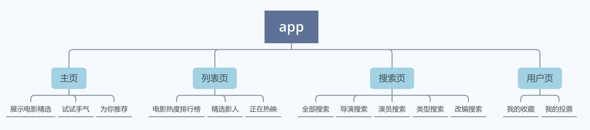

# swfit-movie
Data and Structure course project 数据结构课设
## 概述Overview
本项目是一个利用**swiftUI语言编程**实现的电影库系统手机应用软件，数据使用本地JSON数据解码。

主要功能有：主页电影精选、排行榜、精选电影分类、电影搜索以及用户收藏与点赞电影汇总。其中展示的影视信息包括但不限于影片的故事信息、导演信息、演员信息、版本信息，以及对于所有影视的排行实时排序功能。

**本项目支持在Xcode版本12.0或以上的模拟器中、iOS版本为14.3以下的手机运行。**

This project is an iPhone application designed for showing movie information in a conceit way. It's developed with swiftUI and local JSON data on MacOS 11.5.2, Xcode 12.0.

You can run this project on a Xcode stimulator (version 12.0 or above) or on your iPhone (iOS 14.3 or below)

This project contains: 
1. featured movies in homepage. 
2. movie chart in chart page(sorted by vote number in real-time).
3. movie searching via different type of input 
4. collecting or liking a movie and find them in user page.
Movie information showing in movie-detail page is comprised of movie storyline, director, genre, cast and poster.

## 如何运行 run
点击Movie文件夹下的Movie.xcodeproj即可
